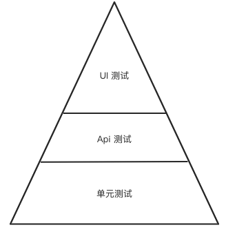
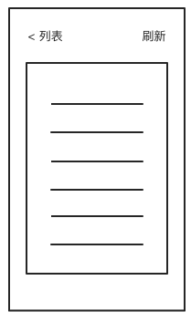
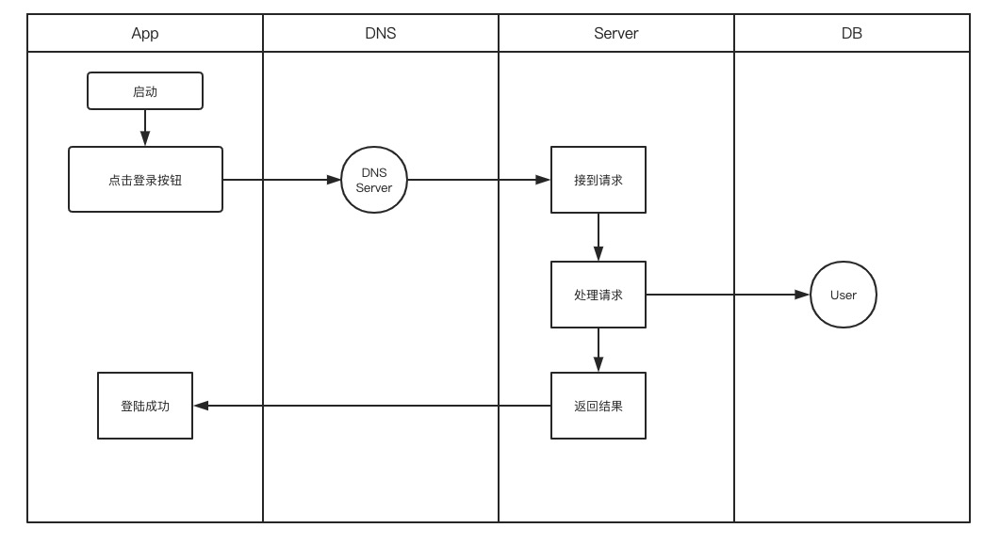

# 自动化测试那些事 - 1

从事自动化测试岗位以来，也有一些不成文的概念。最近恰逢在家，有时间可以总结一下，也顺便也来聊一聊自动化测试相关的那些事。

本文只聊技术相关的内容。

# 入门篇

俗话说：师傅领进门，修行在个人。但无论如何，还是要入门的不是。

## 概念

> 自动化测试

 用一句话来说，自动化测试即用工具实现测试工作。

 注意，自动化测试不是智能测试，并不能发现测试用例之外的问题，所以需要非常注意用例的覆盖率问题。

> 那`自动化`何解？

 自动化即不需要人在测试过程中进行手工干预，即可以按照测试流程自动的进行测试，并输出测试报告。

## 普通测试用例 >>>> 自动化测试用例

其实自动化测试与`windows` 的批处理程序的出现非常相似，都是将简单重复的工作，通过工具将其统一处理。

## 分层

目前的自动化测试大多分为 3 层。



对于测试人员来说，大家接触的更多地可能是 `UI测试` 和 `API测试`，而`单元测试`则更多地是需要开发人员针对实现的方法所编写的测试用例。

而这三种测试当中，`UI` 是最接近用户使用的，`UI` 就是 `User Interface` 的缩写，即用户接口。在测试工作中，这一部分所占的比重最大，因为`UI` 不但包含功能错误，还包含样式、显示逻辑等等问题。

`Api` 测试是与测试人员最密切的，因为功能的实现是由后端来控制的，当后端的的实现都是错误的时候，来测试前端的功能问题，显然是不合理的。`Api` 即是 `Application Interface` 的缩写，即应用接口。由于这一部分会涉及到信息敏感和加密，而且用户也不需要知道我们逻辑交互的具体内容，所以只能由测试人员进行把关。

`单元测试` 即 `Unit Test`，是颗粒度最小的测试用例集合，是针对于方法的测试。

### UI 测试

目前实现 `UI` 测试的各端的方案都有，例如 :

|端|测试框架|
|--|--|
|移动端 app | appium/airtest/katalon |
|浏览器网页 | selenium|

目前的各种方案有基于各个端内置工具的实现，例如 appium、uiautomator 等都是基于 android 或者 ios 的内置工具实现的。也有基于图像识别的工具例如 airtest。也有基于元素识别的 selenium。



上面的图中，像 `列表` 和 `刷新` 等都是具有可定位特性的，比如说使用根据文字查找的方法 `findByText` 这种方法，还有各种其他的定位方法。只有依靠这些方法，我们才能找到我们需要点击的按钮和列表，才可以实现自动化测试。

所以 `普通测试` >>>> `自动化测试` 的过程就是：

- 选用适合当前端的自动化测试工具：磨刀不误砍柴工
- 根据测试用例，编写自动化测试用例
- 执行测试过程，生成测试报告


#### 问题

这当中的难点有两点：

- 1， 如何让代码来实现我们人操作的流程
- 2， 如何让代码知道结果对与错

解决了这两个问题，自动化测试的问题就是迎刃而解。

而相应的存在了很多的工具，就是帮助我们解决上面的两个问题。

我们针对不同的平台，选出可以供我们实现自动化测试的工具，来进行自动化测试。


### API 测试

Api 自动化测试框架比较多，目前常见的有以下几种。

|名称|
|--|
|unittest|
|pytest|
|httprunner|

像 `unittest` 和 `pytest` 都是比较基础的框架，并且包含非常多的插件，可以根据自己的实际情况去使用。而`httprunner` 就有点像集成了很多轮子的综合性框架，可以直接拿来使用。

现在互联网企业的自动化测试大部分以 `api` 用例为主，因为 `api` 处于整个业务功能的更底层，相对于更接近用户层的界面来说，实现的功能更为专业和集中，更加有利于实现自动化测试；并且相对于 `UI` 层的测试来说，更容易制定明确的测试用例，包括明确的输入、输出，对应的响应时间，测试用例的覆盖等。


### 实例

下面，我们就通过一个例子，来介绍一下如何实现`API`自动化测试。

#### 分析原理

首先，我们来看一下正常一个 `app` 是如何工作的。



- App 启动后，输入用户名密码，点击登录按钮
- App 客户端响应登录事件，向后端接口发起请求
- 请求通过DNS和路由转发到服务器上的端口
- 服务器上的路由、负载均衡、容器将端口上的请求根据路径，转发到具体的服务
- 服务接收到具体的请求，解析请求
- 服务执行请求路径所在的具体方法，向数据库查询数据
- 根据执行逻辑后，向已经建立的`http` 连接，回写数据
- App 接收到返回的数据后，解析，并显示登录成功的界面


#### 编写功能测试用例

了解了大概的工作流程后，我们就可以根据这个流程编写测试用例了。这里我只列举一个，并不会覆盖到所有。

- 测试登录功能是否正常

这是一条非常简练的测试用例，并且没有列出具体的细节。

|id| 操作 | 预期 |
|--|--|--|
|1| 输入 用户名 | 可以正常输入 |
|2| 输入 密码 | 可以输入，并显示为加密字符|
|3| 点击 登录按钮 | 可以点击|
|4| 等待 结果| 显示失败或者成功后跳转到具体的页面|

这就是不包含数据的一条测试用例，他被我拆分成了以上的几个步骤。下面我们就可以根据这几个步骤编写自动化测试用例了。

#### 实现为自动化测试用例

自动化用例有一个非常鲜明地特点，就是每一个步骤都要有明确的输入输出，并且会有可以判断的结果。

所以我们可以假设使用 `appium` 进行这个用例的实现。这里我只给出了伪代码。


> 获取 各个元素的定位，可以帮助我们实现点击和输入操作

```python
username_input = driver.getById("username") 
password_input = driver.getById("password")
login_button = driver.getById("login")
```
> 实现流程

```python
# 流程1
def input_username_stage(username):
    username_input.input(username)
    # 这里只是简单判断了一下输入的内容与存在的内容是否一样
    assert username_input.getText() == username

# .... 
```

按照上面的流程1实现其他流程后，就可以运行，来进行自动化测试了。


> 运行测试

```shell
python test.py
```


> 注意：我们只需要将输入的内容和流程，封装成方法，便可以进行复用，实现参数化自动化测试。

看到这里，是不是非常简单？下面我们继续拆分真个测试流程中的 `api` 测试。

#### api 测试用例

我们可以根据接口给出的文档，来进行参数的定制和测试。

整个请求的过程，我们可以使用`python` 的`requests` 进行模拟。

> 文档：例子：登录

- url : http://test.com/v1/login
- method: post
- params

|id | name| type| remark|
|--|--|--|--|
|1| username| string| 用户名|
|2| password| string| 密码，这里一般是密文，我们此处就用明文|

根据上面的文档，我们可以设计功能测试用例，实际上跟上面的用例相似，但是省去了操作过程。


> 测试用例设计

- 使用 postman 请求接口地址

具体的举个例子吧：

- 使用 get 方法请求接口，应该返回 405，method not allow 这种代码
- 使用 post 方法请求接口，使用不同的参数，应该返回 200，并返回请求结果

那么我们根据测试用例，可以更简单的实现自动化测试：

```python
// 举个例子，不能直接使用，是伪代码
import requests, json

def test_login(method, username, password):
    data = {
        "username": username,
        "password": password
    }
    res = requests.getattr("method")(url, json=data, headers={})
    assert res.data.get("code") == 0
    assert res.data.get("message") == "ok"
```

以上就是一个简单地自动化测试用例了，当然，还需要集合测试框架进行运行，并生成测试报告，才可以算是一个真正的自动化测试用例，下一章节我打算讲下自动化测试框架的设计与构建。